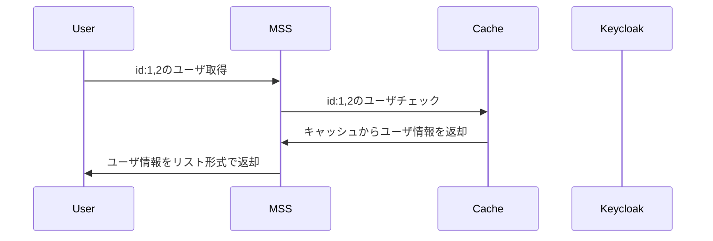
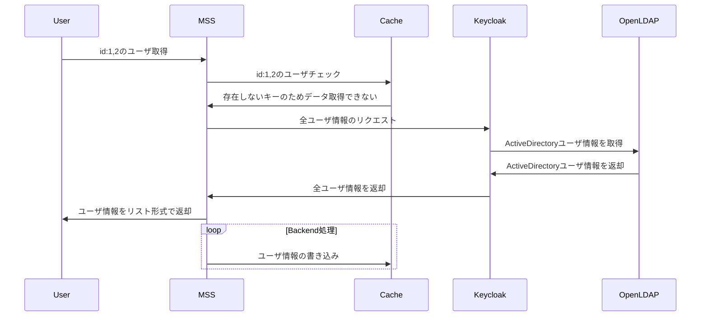
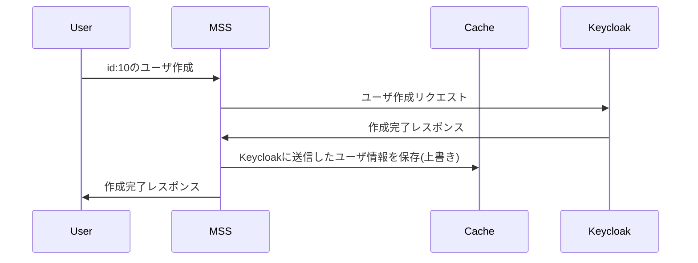

# keycloak-with-cache
## 目的
キャッシュにアカウント情報が存在する場合は、キャッシュサーバにデータを取得することで不要なKeycloakへのリクエストを避ける。

## 背景
Keycloak→LDAPにアカウント情報を取りに行く際、LDAPの仕様ですべてのユーザを取得していた。その結果、Keycloak→OpenLDAPへのリクエストがボトルネックとなり処理の遅延が発生している。

## 📄 実装案

以下のような実装を考えている。

- 外部キャッシュ(memcache)を利用し、Keycloakユーザのデータを取得する
- Keycloak

## Cacheのデータ構造

基本はidをKeyにして保存。全ユーザ取得を定期的に取得する必要がある場合は、allなどをKeyとして、リスト型の状態でデータを保存する。

| Key         | Value |
|-------------| ------------- |
| gu.<GUID>   | {"id":123,"val":23,...}  |
| gu.<GUID>   | {"id":222,"val":23,...}  |
| bpd.<BPDID> | [{"id":123,"val":23,...},{"id":222,"val":23,...}] |

## シークエンス図
### キャッシュにユーザが存在する場合

### キャッシュにユーザが存在しない場合

### Keycloakユーザを更新/作成するとき

## memcache or redis

大量のアクセスが想定され、速度やスケーリングを考慮する場合、memcachedを選択。
それらを考慮する必要がない、またはトランザクション処理を利用したい場合はredisを選択。
https://aws.amazon.com/jp/elasticache/redis-vs-memcached/

ミリ秒単位でデータの正確性を考慮しないのでよいであれば、memcachedの利用で良いと考えている。